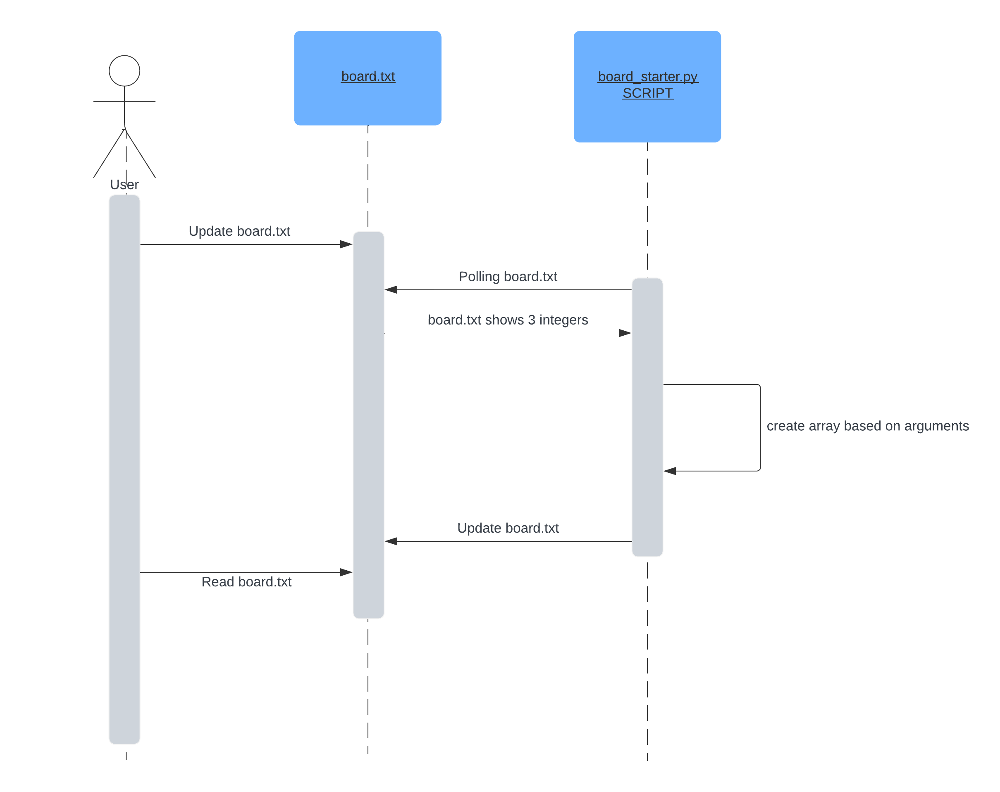

# CS361-journal-program

## Minesweeper Microservice
The microservice utilizes `board.txt` to generate a Minesweeper game board. Input three integers, separated by a space, and the microserice will output a sequence of 0s and 1s representing the game board.

### Setup
1. Run `board_starter.py` in your console.
2. The script polls `board.txt`` every half-second for updates.

### To REQUEST Data
Write 3 integers separated by a space in the `board.txt` file. The three integers represent `width height number_of_bombs`. 

For example, if we wanted a minesweeper board that was 4 wide, 5 tall, with 7 bombs, we would write
```
4 5 7
```
to the `board.txt` file and save.

### To RECEIVE Data
The `board_starter.py` script will process this input within half a second and zero-initialize an array of length `width * height`. The script will then assign 1s (or bombs) to random positions in the array. The number of bombs will be equal to `number_of_bombs`. This array will replace the three integers in `board.txt`, formatted as numbers separated by spaces.

For example, a game board that is 4 across, 5 tall, with 7 bombs may write a sequence of numbers like so:
```
0 1 0 1 1 0 0 0 0 1 1 0 1 0 0 0 0 0 0 1
```

Use this output to initialize your Minesweeper board.

### Sequence Diagram
